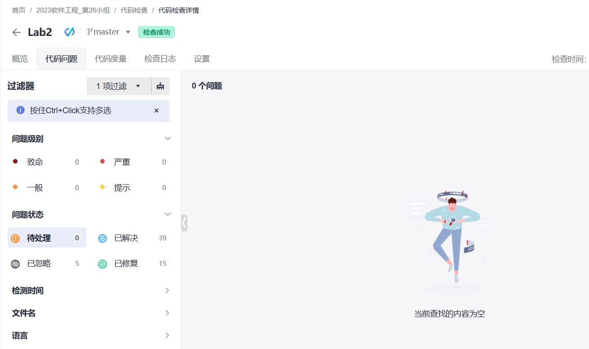

# lab3实验报告

## 小组分工  

* 前端：
周旭涛：购物车和商品部分及相应的管理员批准页面，最终接口核对
马莫涵：用户、商户、管理员页面，路由
* 后端：刘正珺、王俊儒

## 实验设计

## 问题及解决方案

1. 前端信息获取问题。
解决方案：直接解析token获取用户相关信息，通过解析到的userId可进一步向后端发送请求获取商店信息、购物车信息等,再通过商店信息中的shopId发送请求得到商品信息等。
2. 用户、商户、管理员页面都要有导航栏并始终处在正确的位置，并且在其导向的每个子页面中都应有导航栏。
解决方案：提取了AdminHeader MainPageHeader 组件为页面导航内容，并设置style的width和margin属性使导航栏的呈现位置大小较符合人的习惯。为解决路由子页面中没有导航栏，对index.js中的路由进行了重整，把导向的页面设为主页面的children。
3. 后端功能还没有完成的情况下页面测试调整的问题。
在接口确定但后端功能还未完成的情况下需要测试调整页面，使用了mocky写了部分静态用例，不用考虑跨域通信的问题，可以查看页面效果是否达到预期。
4. 后端随着功能的增加，类的依赖变得臃肿，前期完成的部分功能没有考虑到未来的需求，导致扩展性不强，在本次lab中不得不在低质量代码上继续开发。在本次lab中，对部分关键代码做出重构。

## 代码检查结果

## 缺陷管理

这次lab开发没有使用华为云工作项下的缺陷功能，代码缺陷主要由负责此部分的成员记录修改，在最终的测试环节里统一做最后的修改。借助了华为云代码检查功能，对不同级别的问题做了处理和修改。
比如java代码中业务层的实现逻辑出现错误，会使用文档记录位置和修改办法，并在之后进行更改

## 选做项完成情况

## Tag截图

## 心得体会

马莫涵：此次lab涉及很多细节，逻辑比较繁杂琐碎，现在还有很多不成熟的地方，希望在后期迭代中变得更好。
